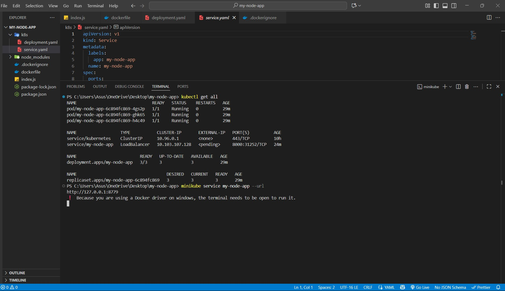
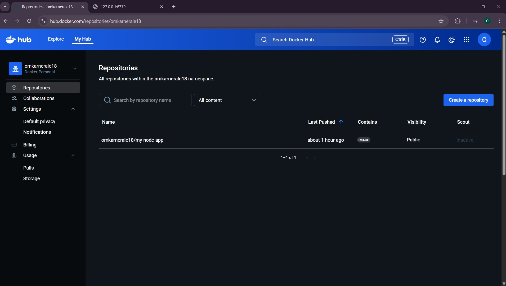
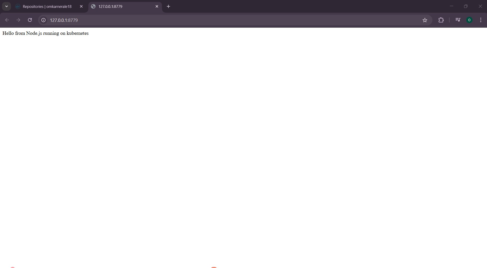

# Node.js Kubernetes Deployment 🚀

This project demonstrates how to containerize a **simple Hello World Node.js application**, push the image to **Docker Hub**, and deploy it on a Kubernetes cluster using **Minikube**.

## 📌 Features
- Simple Hello World Node.js app
- Dockerfile for containerization
- Docker image pushed to Docker Hub
- Kubernetes Deployment (`deployment.yaml`)
- Kubernetes Service (`service.yaml`)
- Tested on Minikube with Docker driver

---

## 🛠️ Prerequisites
- [Docker Desktop](https://www.docker.com/products/docker-desktop/)
- [Minikube](https://minikube.sigs.k8s.io/docs/start/)
- [kubectl](https://kubernetes.io/docs/tasks/tools/)
- A [Docker Hub](https://hub.docker.com/) account

---

## 📸 Screenshots  

### ✅ Kubernetes Deployment Running


### ✅ Docker Hub Repository


### ✅ App Running in Browser


---

## 🔮 Future Improvements  
- Implement CI/CD pipeline with GitHub Actions/Jenkins
- Deploy using Helm charts for easier management 
---
## 🚀 Setup Instructions


```bash
git clone https://github.com/<your-username>/nodejs-kubernetes-deployment.git
cd nodejs-kubernetes-deployment
# Build Docker image
docker build -t <your-dockerhub-username>/my-node-app:1.0 .

# Push to Docker Hub
docker push <your-dockerhub-username>/my-node-app:1.0

# Start Minikube 
minikube start --driver=docker

# Apply Kubernetes Manifests
kubectl apply -f k8s/deployment.yaml
kubectl apply -f k8s/service.yaml


